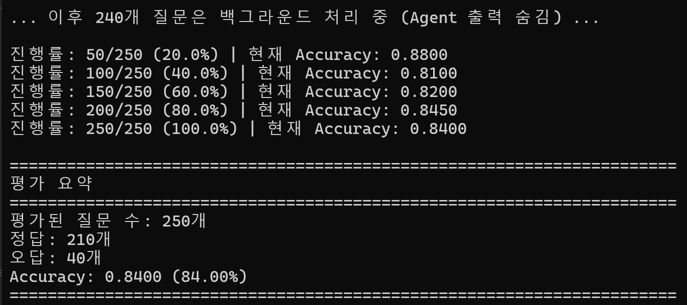

# Multi-Agent RAG System with LangGraph

LangGraph를 활용한 멀티 에이전트 RAG(Retrieval-Augmented Generation) 시스템입니다.  
(코드 품질 검사 도구 ruff 등을 사용하여 코드 품질을 지켰습니다.)  

## 빠른 테스트 (가상환경-코드 체크-평가 스크립트 실행)

```bash
uv venv --python 3.13
.venv\Scripts\activate
uv pip install -r requirements.txt
make lint
make format
make type-check
python rag_agent.py --input_path data/dev.csv --output_path data/predictions.csv
```

## 프로젝트 개요

이 시스템은 3개의 에이전트로 구성된 RAG 파이프라인을 사용하여 객관식 질문에 답변합니다:

1. **쿼리 분석 및 다각화 Agent**: 질문을 분석하고 검색에 최적화된 다각화 쿼리 생성
2. **문서 검색**: Ensemble Retriever (BM25 + FAISS)를 사용한 하이브리드 검색
3. **Multi-step Reasoning & Answer Agent**: 검색된 문서를 바탕으로 단계적 추론 후 최종 답변 출력

## dev set에 대한 벤치마크 성능



**Accuracy Score: 0.8400 (84.00%)**

- 평가된 질문 수: 250개
- 정답: 210개
- 오답: 40개

## 시스템 아키텍처

```
원본 질문 → [Agent 1: 쿼리 다각화] → [검색: BM25 + FAISS] → [Agent 2: 추론 & 답변] → 최종 답변 (1-4)
```

### Ensemble Retriever

- **BM25** (30%): 키워드 기반 검색
- **FAISS** (70%): 의미 기반 벡터 검색
- **Reciprocal Rank Fusion (RRF)**: 두 검색 결과를 결합

## 시작하기

### 필요 조건

- Python 3.13+
- uv (Python 패키지 관리자)
- OpenAI API Key

### 설치

1. **가상환경 생성**

```bash
uv venv --python 3.13
```

2. **가상환경 활성화**

```bash
# Windows
.venv\Scripts\activate

# macOS/Linux
source .venv/bin/activate
```

3. **의존성 설치**

```bash
uv pip install -r requirements.txt
```

### 환경 변수 설정

`rag_agent.py` 파일의 36-38번째 줄에서 OpenAI API Key를 설정하거나, 환경 변수로 설정하세요:

```python
os.environ["OPENAI_API_KEY"] = "your-api-key-here"
```

또는 `.env` 파일 사용:

```bash
OPENAI_API_KEY=your-api-key-here
```

## 파일 구조

```


CSRAG_EnsembleRAG/
├── rag_agent.py              # 메인 실행 파일 (RAG 평가)
├── ensemble_retriever.py     # Ensemble Retriever 클래스
├── requirements.txt          # 의존성 패키지 목록
├── Makefile                  # 코드 품질 관리 명령어
├── README.md                 # 프로젝트 문서
├── images/                   # 문서용 이미지
│   └── performance_results.png

```

### 파일 설명

- **`rag_agent.py`**: Multi-Agent RAG 시스템 메인 실행 파일
- **`ensemble_retriever.py`**: BM25와 FAISS를 결합한 Ensemble Retriever 구현

## 사용법

### RAG 성능 평가 실행

기본 실행:

```bash
python rag_agent.py --input_path data/dev.csv --output_path data/predictions.csv
```

### 커맨드라인 옵션

| 옵션 | 설명 | 기본값 |
|------|------|--------|
| `--input_path` | 평가할 입력 CSV 파일 경로 | 필수 |
| `--output_path` | 예측 결과를 저장할 CSV 파일 경로 | 필수 |
| `--knowledge_base` | Knowledge Base로 사용할 CSV 파일 경로 | `train_processed.csv` |
| `--verbose` | 상세 출력할 질문 개수 | `10` |

### 사용 예시

```bash
# 기본 실행
python rag_agent.py --input_path data/dev.csv --output_path data/predictions.csv

# verbose 출력 개수 조절
python rag_agent.py --input_path data/dev.csv --output_path data/predictions.csv --verbose 5

# 커스텀 Knowledge Base 사용
python rag_agent.py --input_path data/dev.csv --output_path data/predictions.csv --knowledge_base custom_train.csv
```

## 개발 도구

### 코드 스타일 체크

```bash
# Linting (코드 품질 검사)
make lint

# Formatting (코드 자동 포맷팅)
make format

# Type checking (타입 검사)
make type-check
```

## 출력 형식

### 평가 중 출력

```
Dev Set 평가 시작 (전체 250개 질문)
======================================================================
Knowledge Base: train_processed.csv
Test Set: data/dev.csv
상세 출력: 첫 10개 질문만
======================================================================

[1/250] NTFS 파일시스템에서 부팅과정에서 읽어들이는 부분으로...
 [Agent 1] 쿼리 분석 및 다각화 시작...
  ✓ 분석: 질문은 NTFS 파일 시스템의 부팅 관련 구성 요소...
  ✓ 원본 쿼리: 1개 (유지)
  ✓ 다각화 쿼리: 2개 생성
  ✓ 총 사용 쿼리: 3개
[검색] 문서 검색 시작...
  → 총 3개 쿼리로 검색 (원본 1개 + 다각화 2개)
  ✓ 검색된 문서: 15개 (중복 제거 후)
[Agent 2] Multi-step Reasoning & Answer 시작...
  ✓ 추론 단계: 3개
  ✓ 결론: MFT는 Master File Table의 약자로...
  ✓ 최종 답변: 2
  정답: 2 | Agent: 2 |  정답
```

### 평가 요약

```
======================================================================
평가 요약
======================================================================
평가된 질문 수: 250개
정답: 210개
오답: 40개
Accuracy: 0.8400 (84.00%)
======================================================================
```

### 출력 파일 (`predictions.csv`)

원본 `dev.csv`에 다음 컬럼이 추가됩니다:

- `predicted_answer`: 에이전트가 예측한 답변 (1-4)
- `is_correct`: 정답 여부 (`correct` 또는 `incorrect`)

## 주요 기능

### 1. 쿼리 다각화

원본 질문을 분석하여 2개의 다각화된 쿼리를 생성하고, 총 3개의 쿼리로 검색을 수행합니다.

### 2. Ensemble Retriever

- **BM25**: 키워드 매칭 기반 검색
- **FAISS**: OpenAI 임베딩을 사용한 의미 기반 검색
- **RRF**: Reciprocal Rank Fusion으로 두 결과를 결합

### 3. Multi-step Reasoning

검색된 문서를 바탕으로 단계적 추론을 수행하여 최종 답변을 도출합니다.

### 4. 진행률 표시

- 첫 10개(기본값) 질문: 상세 출력
- 이후 질문: 백그라운드 처리 (50개마다 진행률 표시)

## 의존성 패키지

주요 패키지:

- **langchain**: LLM 애플리케이션 프레임워크
- **langgraph**: 멀티 에이전트 워크플로우
- **faiss-cpu**: 벡터 유사도 검색
- **rank-bm25**: BM25 알고리즘 구현
- **openai**: OpenAI API 클라이언트
- **pandas**: 데이터 처리

전체 목록은 `requirements.txt`를 참조하세요.

## 유의사항

### ModuleNotFoundError: No module named 'ensemble_retriever'

`ensemble_retriever.py` 파일이 `rag_agent.py`와 같은 디렉토리에 있는지 확인하세요.

### OpenAI API 오류

`OPENAI_API_KEY` 환경 변수가 올바르게 설정되었는지 확인하세요.

### FAISS 설치 오류 (Windows)

Microsoft C++ Build Tools가 필요할 수 있습니다. `faiss-cpu` 대신 `faiss-cpu-binary`를 사용해보세요.

---

**최종 업데이트**: 2025-11-25


